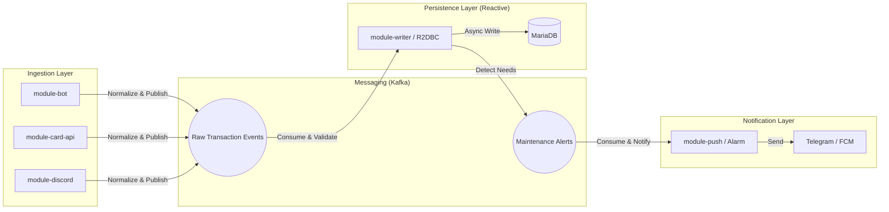

# 🚗 Vehicle Service Manager (Car Ledger)

차량 제원 관리, 정비 이력 추적, 그리고 텔레그램 봇 연동을 통한 스마트 차계부 시스템입니다. 
본 프로젝트는 효율적인 차량 유지보수와 지출 관리를 목표로 합니다.

---

## 🛠️ 기술 스택 (Tech Stack)

### Backend (Multi-Module)
- **Framework**: Spring Boot 4.0.4, Kotlin 2.2.0 (JDK 21)
- **Data Access**: Spring Data JPA, QueryDSL 7.1 (Jakarta EE)
- **Database**: MariaDB 11.x, Liquibase (Database Migration)
- **Security**: Spring Security, JWT (jjwt 0.12.5)
- **Build Tool**: Gradle (Kotlin DSL)

### Frontend
- **Framework**: Next.js 16.2.1 (App Router)
- **Styling**: Tailwind CSS, Lucide React (Icons)
- **State/Data**: React-Query (@tanstack/react-query 5.95.2), Axios
- **Visualization**: Recharts (Dashboard statistics)

### Infrastructure
- **Container**: Docker, Docker Compose
- **Proxy**: Nginx

---

## 📁 프로젝트 구조 (Project Structure)

```text
Vehicle-Service-Manager/
├── backend/
│   ├── module-core/                # 핵심 도메인 및 데이터 접근 계층
│   │   └── src/main/kotlin/com/carledger/core/
│   │       ├── vehicle/domain/     # 차량, 제원(Spec), 타이어/휠 엔티티
│   │       ├── ledger/domain/      # 차계부 엔티티 및 정비 타입 정의
│   │       ├── member/domain/      # 사용자 및 설정 엔티티
│   │       └── common/             # JPA Auditing, QueryDSL 공통 설정
│   ├── module-web/                 # 사용자 API 및 보안 계층
│   │   ├── src/main/kotlin/com/carledger/web/
│   │   │   ├── common/security/    # JWT 필터, 인증 프로바이더
│   │   │   └── domain/             # 각 도메인별 Controller, Service, DTO
│   │   └── src/main/resources/db/  # Liquibase 마이그레이션 (changelog-master.xml)
│   └── module-bot/                 # 외부 봇 인터페이스 계층
│       └── src/main/kotlin/com/carledger/bot/
│           ├── telegram/           # 텔레그램 봇 API 클라이언트
│           ├── parser/             # 메시지 정규식 파싱 및 명령 처리
│           └── service/            # 봇 전용 비즈니스 로직
├── frontend/                       # Next.js 프론트엔드 프로젝트
│   └── src/
│       ├── app/                    # App Router 기반 페이지 ((auth), (dashboard))
│       ├── components/             # 재사용 가능한 UI 컴포넌트
│       ├── hooks/                  # API 연동을 위한 Custom Hooks
│       ├── context/                # 전역 상태 관리 Context API
│       └── lib/                    # Axios 인스턴스 및 공통 유틸리티
└── infra/                          # 인프라 설정 및 도커 구성
    ├── nginx/                      # Nginx 설정 (default.conf)
    ├── docker-compose.yml          # MariaDB, Nginx 컨테이너 설정
    └── .env                        # 인프라 환경 변수 관리 (Git 무시)
```

---

## 🚀 시작하기 (Getting Started)

### 1. 인프라 설정 (Docker)
`infra` 디렉토리로 이동하여 데이터베이스와 프록시 서버를 실행합니다.
```bash
cd infra
# .env 파일을 생성하여 MARIADB_ROOT_PASSWORD 등을 설정하세요.
docker-compose up -d
```

### 2. 백엔드 실행
```bash
cd backend
# QueryDSL QClass 생성
./gradlew :module-core:compileKotlin
# 웹 서버 실행
./gradlew :module-web:bootRun
```

### 3. 프론트엔드 실행
```bash
cd frontend
npm install
npm run dev
```

---

## 🔑 핵심 기능 및 설계

### 1. 멀티 모듈 아키텍처
- **`module-core`**: 순수 도메인 로직과 데이터 접근 계층을 분리하여 재사용성을 높였습니다.
- **`module-web`**: 사용자 대면 API와 보안을 담당합니다.
- **`module-bot`**: 외부 플랫폼(텔레그램)과의 인터페이스를 독립적으로 관리합니다.

### 2. 데이터베이스 관리 (Liquibase)
- 모든 DB 스키마 변경 사항은 `module-web`의 `resources/db` 하위의 XML 파일을 통해 버전 관리됩니다.
- 초기 스키마(`1.0.0`)부터 정규화(`1.0.1`~`1.0.3`) 과정이 체계적으로 기록되어 있습니다.

### 3. 지능형 차계부 및 정비 이력
- 차계부 등록 시 '정비' 카테고리를 선택하면 소모품 교환 이력(`MaintenanceType`)이 자동으로 업데이트됩니다.
- 차량별 마지막 정비일과 주행거리를 기반으로 교체 주기를 계산합니다.

---

## 📡 주요 API 엔드포인트

| Method | URL | 설명 |
|--------|-----|------|
| POST | `/api/auth/login` | 로그인 및 JWT 발급 |
| GET | `/api/vehicles` | 내 차량 목록 및 정비 요약 조회 |
| POST | `/api/ledgers` | 차계부/정비 내역 등록 |
| GET | `/api/bot/status` | 텔레그램 봇 연결 상태 확인 |

---

## 📌 현재 개발 현황

### ✅ 구현 완료
- [x] 프로젝트 멀티 모듈 구조 수립
- [x] JWT 기반 인증 및 인가 시스템
- [x] 차량 제원 및 정비 타입 정규화 (Liquibase)
- [x] 텔레그램 봇 메시지 파싱 및 연동 기초
- [x] Docker Compose 기반 인프라 구성 (MariaDB, Nginx)
- [x] 프론트엔드 대시보드 및 가계부 목록/상세 조회 UI
- [x] 시간 데이터 표준화 (Instant) 및 QueryDSL 고도화 (Paging)
- [x] 정비 기록(MaintenanceRecord) 및 차계부(Ledger) 통합 관리 로직
- [x] 대시보드 성능 최적화: 단일 API를 4개의 독립적 엔드포인트로 분리 (Summaries, Spending, History, Efficiency)
- [x] 전기차(EV) 대응: 유종에 따른 동적 라벨(주유/충전) 및 단위(L/kWh) 전환 로직 구현
- [x] 정밀 기록 시스템: 날짜 단위에서 시/분 단위까지 정밀한 시간 데이터 기록 및 표시
- [x] UI 표준화: ENUM 코드 대신 사용자 친화적인 한글 이름(가솔린, 전기 등) 표시

### 🚧 진행 중 / 예정
- [ ] 유가 정보 API(Opinet) 실시간 연동 및 주유 추천 서비스
- [ ] 텔레그램 봇 인라인 키보드 기반 차계부 원격 관리
- [ ] 소모품 교체 주기 알림 알고리즘 고도화 및 Push 알림
- [ ] DevOps: Docker 이미지 빌드 및 CI/CD 파이프라인 구축

---

## 🏗️ 향후 아키텍처 로드맵 (Future Architecture)

시스템의 확장성과 대량 데이터 처리 능력을 강화하기 위해 **이벤트 기반 아키텍처(EDA)**로의 전환을 계획하고 있습니다.



### 주요 추진 방향
1. **데이터 정규화 (Normalization)**: 텔레그램, 카드사 API 등 다양한 출처의 데이터를 표준 규격(Canonical Schema)으로 변환하여 시스템 일관성 확보.
2. **비동기 파이프라인 (Kafka)**: 메시지 브로커를 통한 입력 모듈과 저장 모듈의 완전한 분리(Decoupling) 및 장애 내구성 확보.
3. **리액티브 쓰기 (Reactive Writer)**: Spring WebFlux와 R2DBC를 활용하여 대량의 카드 내역 유입 시에도 최소한의 리소스로 고성능 처리가 가능한 전용 모듈 운영.
4. **전용 알림 모듈 (Push Alarm)**: 정비 주기 도래나 이상 징후 감지 시 Kafka를 통해 알림 이벤트를 발행하고, 이를 전용 모듈이 수신하여 텔레그램, App Push 등 다양한 채널로 발송하는 구조 구축.
5. **멱등성 보장 (Idempotency)**: 승인 번호 및 일시 기반의 중복 체크 로직을 통해 데이터의 무결성 유지.

---

## 🤝 컨벤션 (Convention)
- 모든 문서 및 커밋 메시지는 **한글**을 우선적으로 사용합니다.
- 코드 변경 사항은 반드시 관련 테스트 또는 검증 과정을 거칩니다.
- 상세 지침은 `GEMINI.md`를 참조하세요.
